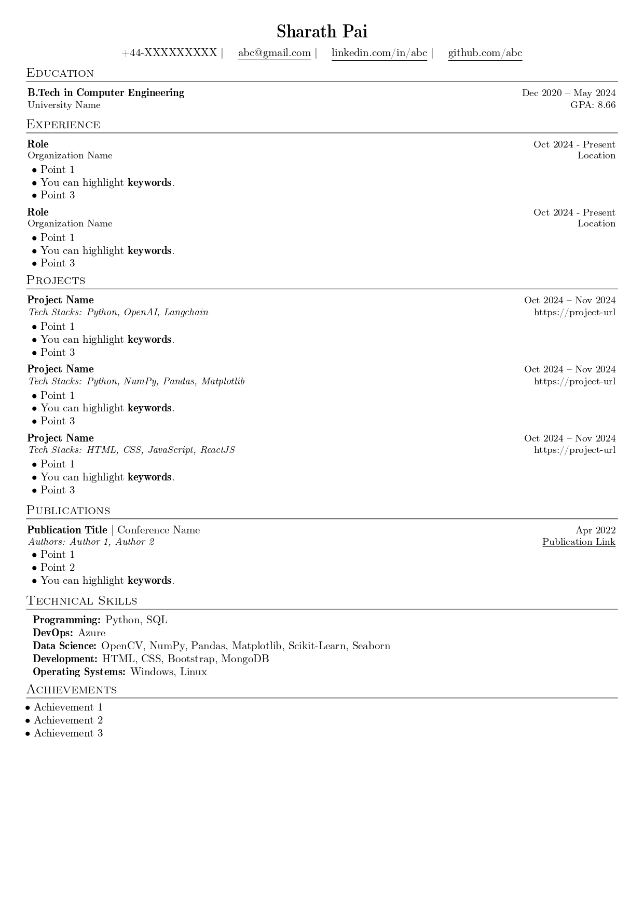

A one-column resume for software developers. It uses the base latex templates and fonts to provide ease of use and installation when trying to update the resume. The different sections are well organized and clearly documented. Custom commands are used to provide consistent formatting. The three main sections in the resume are education, experience, and projects.

### Quick start

Get started quickly using [Overleaf](https://www.overleaf.com/latex/templates/sde-template-sharath/srkjmnmjfmnz) template.

### Preview

